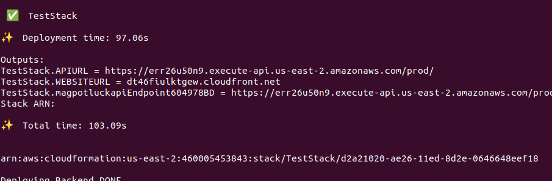

# Deployment Guide

## Deployment 

### Prerequisites

1. An AWS account to deploy the cloud resources 
   - Go to [AWS](https://aws.amazon.com/) to create an AWS account by choosing the best option available as per need.
2. AWS IAM user for running programmatic deployments
   - Refer to aws documentation [Creating an IAM user in your AWS account](https://docs.aws.amazon.com/IAM/latest/UserGuide/id_users_create.html) on how to create user account with required permissions
3. Configure AWS SES to send emails
   - Make sure that the SES is configured in the same region where you plan to deploy the service
   - Follow steps here to configure SES : [Moving out of the Amazon SES sandbox](https://docs.aws.amazon.com/ses/latest/dg/request-production-access.html)

### Linux/Unix

1. Open the terminal.
2. Install dependencies by pasting following code - 
    ```shell
        sudo apt-get update
        sudo apt install curl
        sudo apt-get install awscli
        sudo apt-get -y install nodejs
        sudo apt install -y npm
        sudo npm install -g n
        sudo n 18.13.0
    ```
2. Restart the terminal
3. Configure AWS credentials in your system
   ```shell
      aws configure
   ```
   Running this command will show prompts to add your AWS account credentials by entering your AWS Access Key ID and Secret Access Key.   
4. Clone or Download the Zip of this repository
5. change your directory to the project directory
   ```shell
      cd mag-potluck
   ```
6. Update the file [configuration.yaml](Backend/configuration.yaml) with required configuration data.
   ```yaml
      ID: id_to_identify_resources_in_aws
      userPoolName: userpool_name
      Email: some_email@email.com
      Region: valid_aws_region
   ```
   - `ID` is used as an identifier to all the resources created in AWS cloud. This ID will be appended to the name of all resources that are deployed for this project
   - `userPoolName` is the name of the user-pool created in AWS cognito for user authentication. This can be any string value that makes sense to the user.
   - `Email` is the email address that is verified in AWS SES (step 3). The recipients of the emails from this service will see this as the from address.
   - `Region` is a valid aws region where the resources are to be deployed
7. Run commands to install NPM dependencies.
   ```shell
      sudo npm install -g aws-cdk
      sudo npm install ts-node typescript --save-dev --global
      sudo npm install
   ```
8. Provide execution permission to the `Deploy.ts` script
   ```shell
      sudo chmod +x ./Deploy.ts
   ```
9. Run the script for deployment
   ```shell
      ./deploy.ts
   ```
10. The deployment will take around 15 minutes to complete. The screen might look frozen at times, but be patient. 
11. Once the deployment is complete, we can obtain the URL for the deployed website from the output of the `Deploy.ts` script
   
