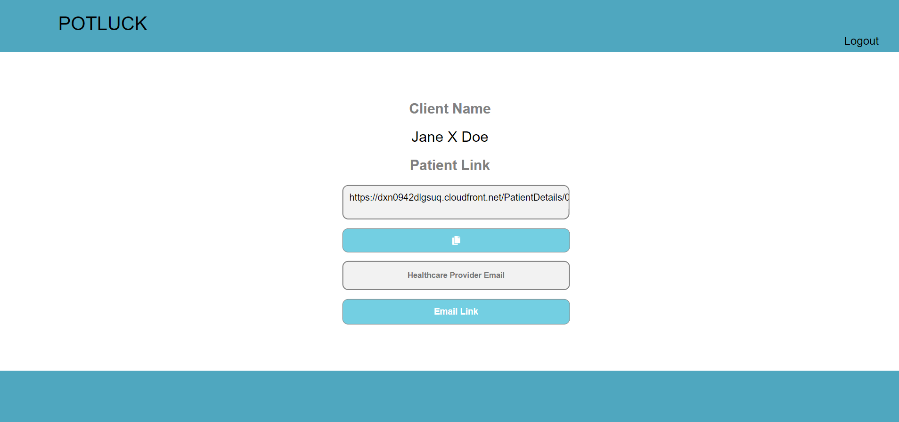
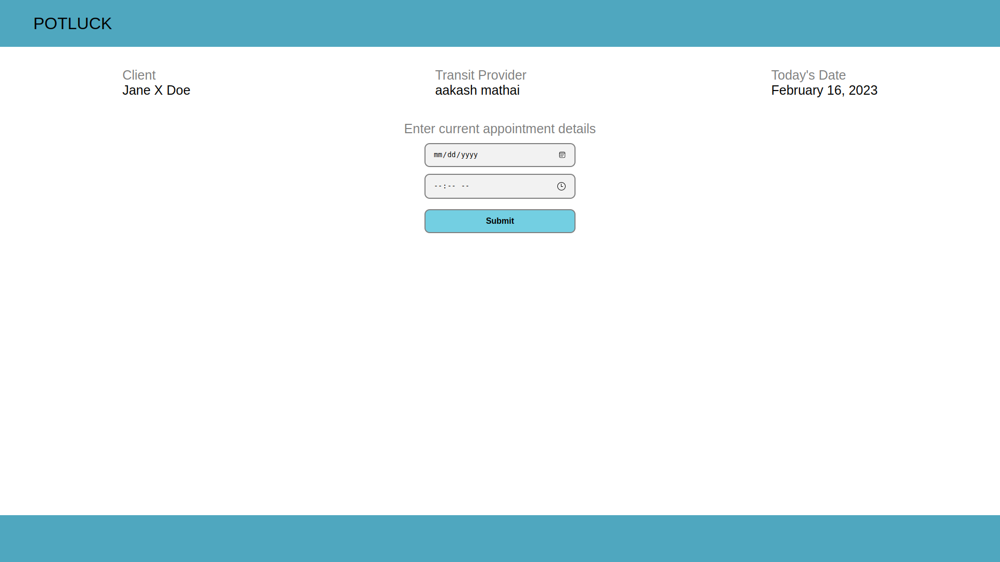
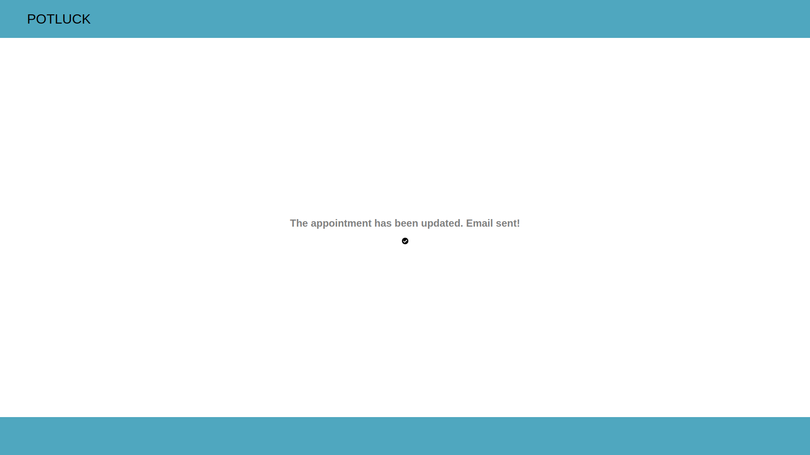

# User Guide / How to use

## Transit Service Provider

1. Attempting a new deployment outputs a link which hosts the system. We need to copy that URL.
2. Launch a browser, paste the URL and Enter.
3. By default, The `login` page will be loaded. This is for the Transit side authentication.
   
      a. If you already have an account, put in your registered Email and password in the textboxes and click on Login. Continue to Step 9.
      b. If you need to register a new user, go to the `signup` link through the message that is displayed. 
   
4. Fill in the required details, and press the `SignUp` button. This will take you to the `email verification` page.
   
5. Input the One Time Password here that you must have got in the email used for registration in step 5. Click on SignUp.
6. Now you have successfully created your account as a transit provider in this web portal.
7. Once the email is confirmed, you will be redirected to the `login` page (Shown in step 3).
8. Login here using the `email` and `password` you used for registration in step 5.
9. Once you have successfully logged in, you will land on the page to input patient details.
   
10. Fill in the first, middle and last name of the patient along with the Healthcare Provider name and click on the `Generate Link` button.
11. The patient's unique URL will be displayed. The URL can be copied using the Copy button or can directly be sent as an email from this page by entering the Email ID and clicking on the 'Email Link' button.
    

## Healthcare Service Provider User Guide

1. The healthcare service provider receives the patients unique URL from the transit service provider.
2. As a healthcare service provider, opening the URL on a web browser will take you to the `Patient Details` page.
   
3. Input the current appointment details of the patient in this page from your records to proceed. 
4. This will take you to a page that gives the options to `Cancel` or `Reschedule` the appointment.
5. Clicking on `Cancel` button will send a notification via email to the transit service provider, saying that the appointment is cancelled.
6. Clicking on the `Reschedule` button will ask you to input the new appointment details by entering the updated date and time.
   
6. Clicking on the `submit` button after filling in the new details, will send a notification via email, to the transit provider, about the updated appointment details.
7. Once you have `cancelled` or `rescheduled` the appointment, you will be taken to a page confirming your action.
   
