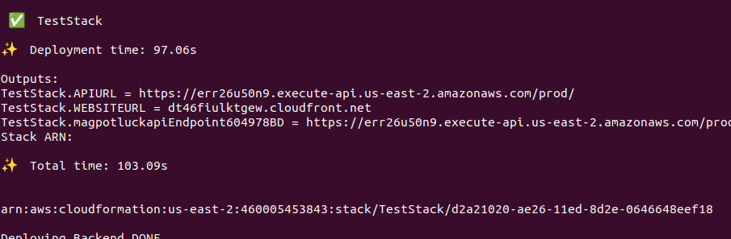
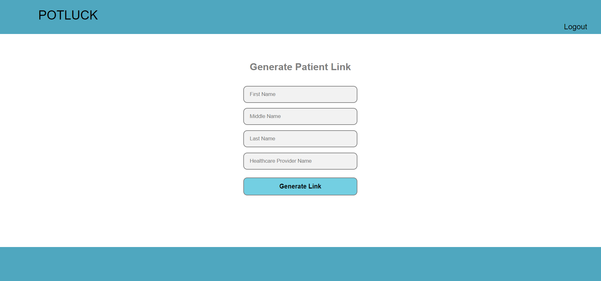

# Mag-Potluck

## Project Overview
Mag potluck is a serverless web application that eases the communication between health care providers and transport agencies in rural areas. 
This aims to help the elderly to avoid fruitless hospital visits in case of a cancelled or postponed appointment.
## Description
Older adults in rural communities overcome long distances, limited
infrastructure and strained resources to access healthcare.
One way non-emergency medical transportation providers support these
communities is by facilitating transportation to Healthcare Providers.
Transportation Agency resources get strained when they are not notified
immediately about rescheduled medical appointments.

Currently, 17% of Transportation Agency rides are canceled on arrival to
Healthcare Providers.  This allows unnecessary trips to be taken and time
and resources to be wasted, both on the side of the patient and the
transportation provider.
## High Level Architecture

## Deployment 
### Linux/Unix
1. Install dependencies
    ```shell
        sudo apt-get update
        sudo apt install curl
        sudo apt-get install awscli
        sudo apt-get -y install nodejs
        sudo apt install -y npm
        npm install -g n
        n 18.13.0
    ```
2. Restart the terminal
3. Configure AWS credentials in your system
4. Clone or Download the Zip of this repository
5. Run commands to install NPM dependencies once you are inside the directory
   ```shell
      npm install -g aws-cdk
      npm install ts-node typescript --save-dev --global
      npm install
   ```
6. Provide execution permission to the `Deploy.ts` script
   ```shell
      chmod +x ./Deploy.ts
   ```
7. Run the script for deployment
   ```shell
      ./deploy.ts
   ```
8. The deployment will take around 15 minutes to complete. The screen might look frozen at times, but be patient. 
9. Once the deployment is complete, we can obtain the URL for the deployed website from the output of the `Deploy.ts` script
   

## User Guide / How to use

### Transit Service Provider

1. Launch a browser and go to the URL.
2. By default, The `login` page will be loaded.
   
3. Go to the `signup` URL to register a new transit user.
   
4. Fill in the required details, and press the `SignUp` button. This will take you to the `email verification` page.
   
5. Input the One Time Password that you have got in your email used for registration in step 5.
6. Now you have successfully created your account as a transit provider in this web portal.
7. Once the email is confirmed, you will be redirected to the `login` page (Shown in step 2).
8. Login here using the `email` and `password` you used for registration in step 4.
9. Once you have successfully logged in, you will land on the page to input patient details.
   
10. Fill in all the details for the patient and click on the `Generate Link` button.
11. The patient's unique URL and an option to email the URL will be displayed. The URL can be copied and sent to
Healthcare providers, or can directly be sent directly as an email from this page.
    

### Healthcare Service Provider

1. The healthcare service provider gets the patients unique URL from the transit service provider.
2. Opening the URL on a web browser will take you to the `patient detail` page.
   
3. Input the current appointment details of the patient in this page. This will take you to a page that gives the options to `Cancel` and `Reschedule` the appointment.
4. Clicking on `Cancel` button will send a notification via email to the transit service provider, saying that the appointment is cancelled.
5. CLicking on the `Reschedule` button will ask you to input the new appointment details.
   
6. Clicking on the `submit` button after filling in the new details, will send a notification via email, to the transit provider, about the new appointment details.
7. Once you have `cancelled` or `rescheduled` the appointment, you will be taken to the following page, confirming your action.
   

## Change Log

## Lessons Learned

## Credits

### Developers

1. Aakash Mathai
   - LinkedIn: https://www.linkedin.com/in/aakash-mathai/
   - GitHub: https://github.com/aakashmathai
2. Anjali Srivastava
   - LinkedIn: https://www.linkedin.com/in/anjalisrivastava/
   - GitHub: https://github.com/AnjaliSrivastava29

### Architect

Arun Arunachalam
- LinkedIn: https://www.linkedin.com/in/arunarunachalam/
- GitHub: https://github.com/

### Program Manager

Jubleen Vilku
- LinkedIn: https://www.linkedin.com/in/jubleen-vilku/
- GitHub: https://github.com/

## License(MIT) 